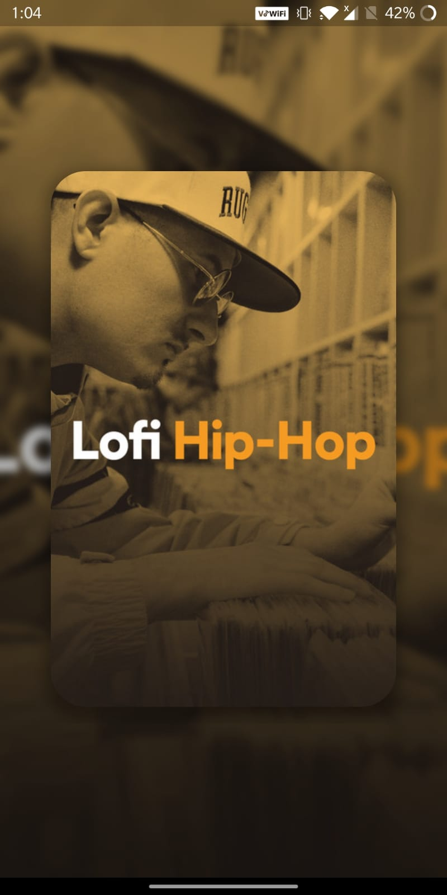
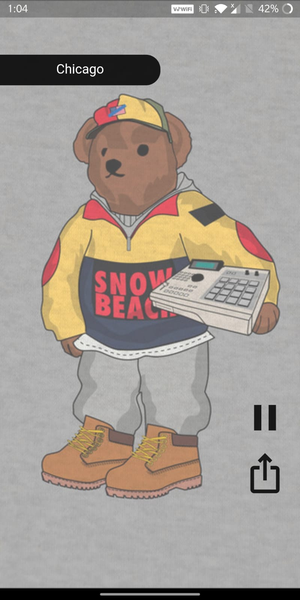

# spotifytiktok

Music Application that is powered by the Spotify Web API and designed like a Tiktok style feed.

      

## Goals
- listen the song ✅
- play/pause the song ✅
- swipe up/down to navigate to the next song ✅
- automatically navigate to next song on completion of current song ✅

## Features
- In-app access token generation provided for Spotify WebAPI authorization
- Created a custom carousel of playlists that fetches weekly updated tracks
- On selection of a Carousel card, the audio player plays the tracks from the relative playlist
